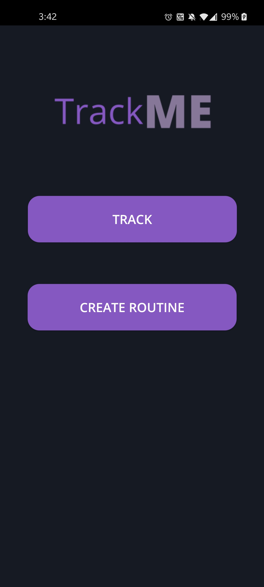
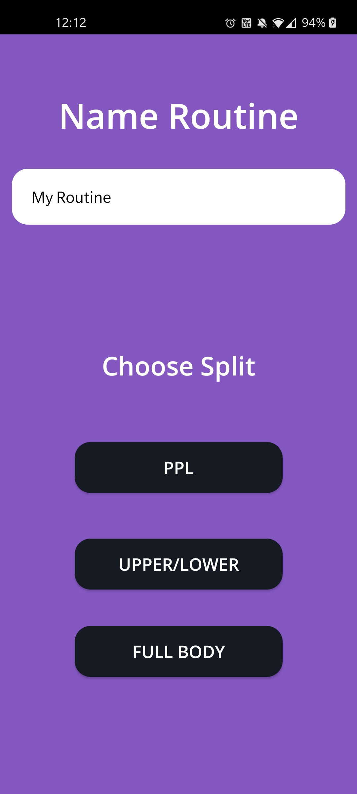
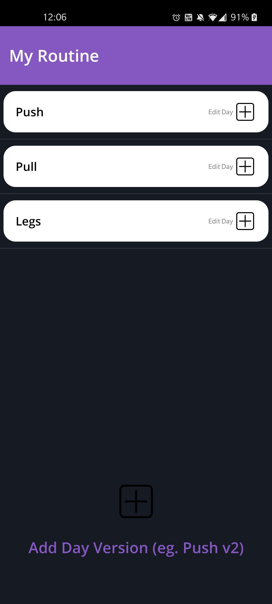
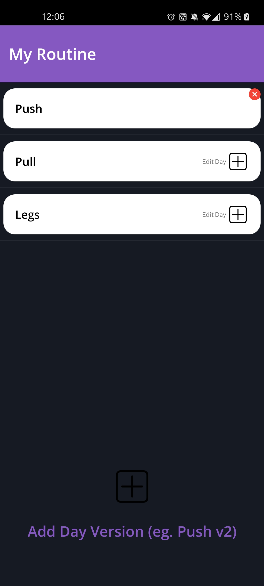

    

I don't have time to go through all the clutter that other similar apps have when I'm on a time crunch at the gym. I was bored, but I also needed an easy, convenient way to track my workouts so I'm making this.
\
\
This is still a work in progress, but I'll show some previews even though no one will probably see any of this.

# Previews
#### Main Screen

    

#### Create Routine Screen

    

#### Edit Routine Screen

    

    

